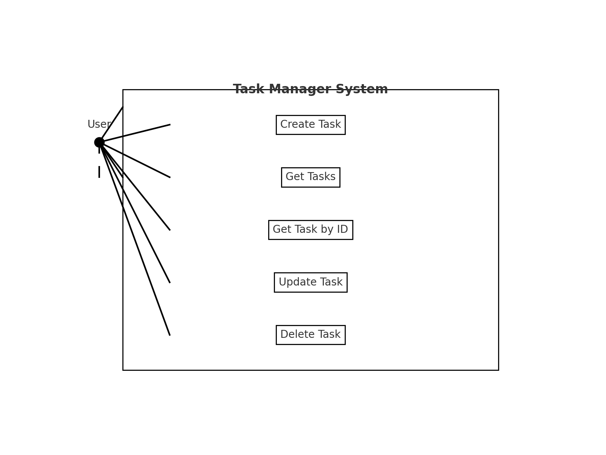
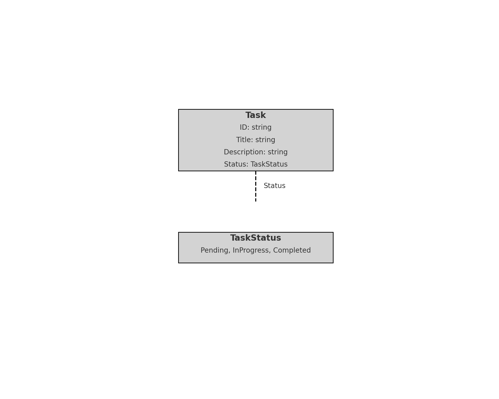

# Task Manager RESTful API Challenge

## Overview

Your challenge is to create a simple RESTful API for managing tasks. The API should support the following operations:

1. Create a new task.
2. Retrieve a list of all tasks.
3. Retrieve a specific task by ID.
4. Update a task by ID.
5. Delete a task by ID.

Each task should have the following attributes:

- ID (auto-generated)
- Title (string)
- Description (string)
- Status (enum: pending, in-progress, completed)

## Instructions

### Requirements

1. Use Go programming language.
2. Use the `mux` router for handling HTTP routes.
3. Use a test library like `testing` and `httptest` for unit testing.
4. Implement basic error handling and validation.
5. Ensure that the code is well-documented and readable.

### Non-Functional Requirements

1. **Performance**: The API should be able to handle a high number of concurrent requests efficiently. Aim for response times of less than 100ms for each API call under normal load.
2. **Scalability**: Design the API in a way that it can be easily scaled horizontally. This includes statelessness and ensuring that the service can be replicated easily.
3. **Security**: Implement basic security measures to protect the API from common threats such as SQL injection and cross-site scripting (XSS).
4. **Maintainability**: Ensure the code is modular and well-documented. Follow Go conventions and best practices to make the codebase easy to understand and extend.
5. **Reliability**: The API should be robust and handle edge cases gracefully. Implement proper error handling and return appropriate HTTP status codes.
6. **Usability**: The API should be easy to use and understand. Provide clear and consistent error messages and ensure that the API follows RESTful principles.

### Setup

1. Clone the repository or download the provided zip file.
2. Navigate to the project directory.
3. Ensure you have Go installed (version 1.15+).
4. Run the following command to install dependencies:

   ```sh
   go get -u github.com/gorilla/mux
   go get -u github.com/google/uuid
   ```

### Running the API

1. To start the server, run:

   ```sh
   go run main.go
   ```

2. The API will be available at `http://localhost:8080`.

### Endpoints

- **Health**
  - **URL**: `/health`
  - **Method**: `GET`

  - **Response**:

    ```json
    {
      "message": "I'm healthy",
    }
    ```

- **Create Task**
  - **URL**: `/tasks`
  - **Method**: `POST`
  - **Request Body**:

    ```json
    {
      "title": "Sample Task",
      "description": "This is a sample task",
      "status": "pending"
    }
    ```

  - **Response**:

    ```json
    {
      "id": "generated-id",
      "title": "Sample Task",
      "description": "This is a sample task",
      "status": "pending"
    }
    ```

- **Get All Tasks**
  - **URL**: `/tasks`
  - **Method**: `GET`
  - **Response**:

    ```json
    [
      {
        "id": "generated-id",
        "title": "Sample Task",
        "description": "This is a sample task",
        "status": "pending"
      }
    ]
    ```

- **Get Task by ID**
  - **URL**: `/tasks/{id}`
  - **Method**: `GET`
  - **Response**:

    ```json
    {
      "id": "generated-id",
      "title": "Sample Task",
      "description": "This is a sample task",
      "status": "pending"
    }
    ```

- **Update Task by ID**
  - **URL**: `/tasks/{id}`
  - **Method**: `PUT`
  - **Request Body**:

    ```json
    {
      "title": "Updated Task",
      "description": "This is an updated task",
      "status": "completed"
    }
    ```

  - **Response**:

    ```json
    {
      "id": "generated-id",
      "title": "Updated Task",
      "description": "This is an updated task",
      "status": "completed"
    }
    ```

- **Delete Task by ID**
  - **URL**: `/tasks/{id}`
  - **Method**: `DELETE`
  - **Response**: `204 No Content`

### Testing

1. To run the tests, use the following command:

   ```sh
   go test
   ```

## Diagrams

### Use Case Diagram



### Class Diagram



## Notes

- Ensure to handle edge cases and invalid inputs appropriately.
- Focus on writing clean, maintainable, and well-documented code.
- Feel free to add any additional features or improvements you deem necessary.